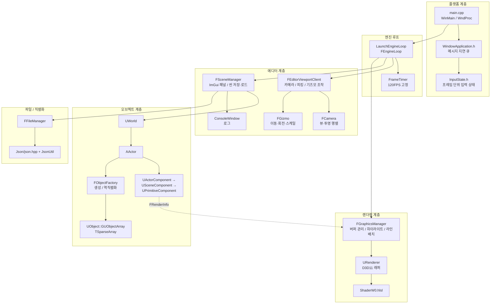
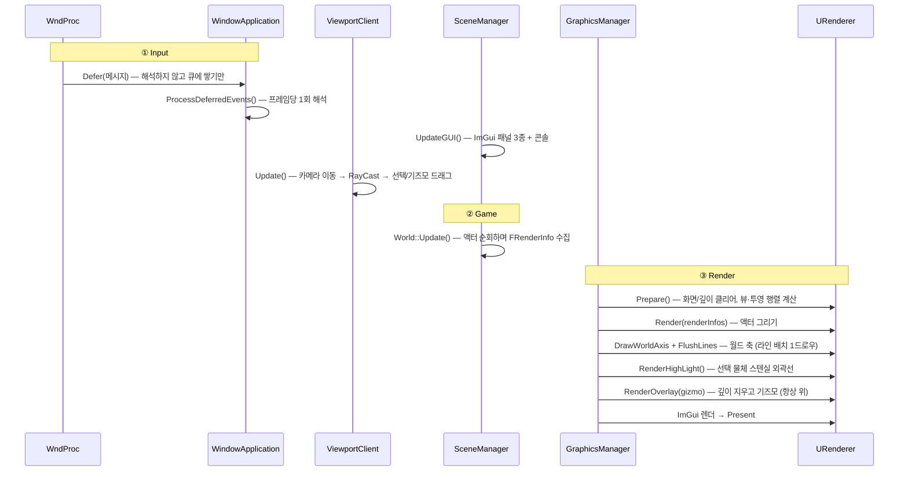
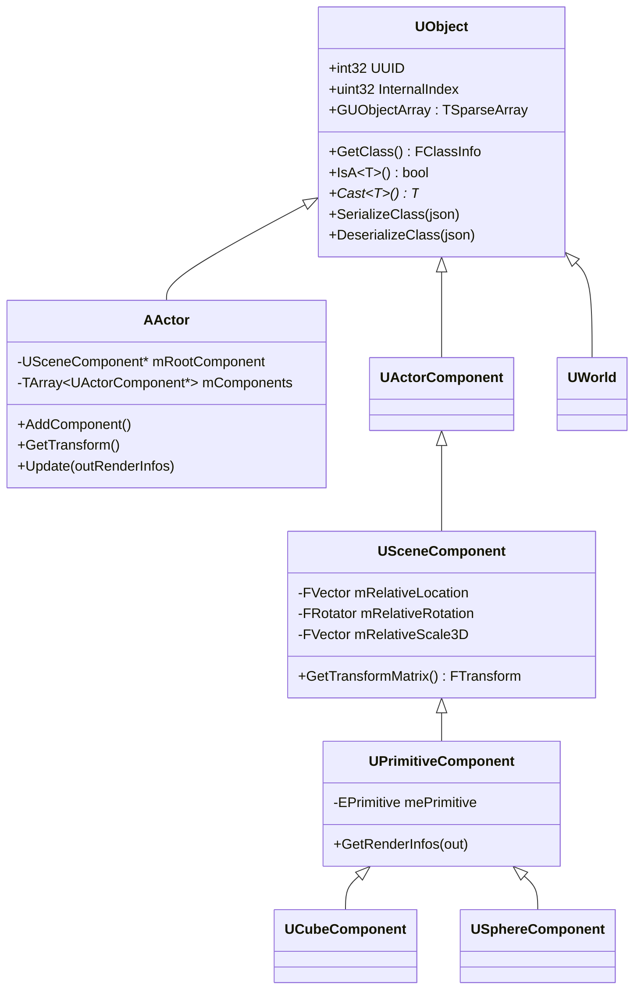
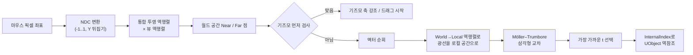

# 02. 전체 아키텍처

이 문서는 "엔진이 한 프레임 동안 무슨 일을 하는가"를 따라가며 각 모듈을 설명합니다.
파일 경로는 모두 `JungleTechLab_Week3/` 기준입니다.

## 1. 모듈 지도



핵심은 **`FRenderInfo`라는 단일 자료구조**가 오브젝트 계층과 렌더링 계층을 잇는다는 점입니다.
오브젝트 계층은 DirectX를 전혀 모르고, 렌더링 계층은 `AActor`를 전혀 모릅니다.

```cpp
// RenderInfo.h — 두 계층 사이의 유일한 계약
struct FRenderInfo
{
    EPrimitive ePrimitive;          // 어떤 메시를 그릴지
    FMatrix    WorldTransformMatrix;// 어디에 그릴지
    FObjectID  ObejctID;            // 누구인지 (피킹 역참조용)
    FVector4   Color;               // Tint (rgb=색, a=섞는 비율)
};
```

## 2. 시작과 종료

### 진입점 (`main.cpp`)

```cpp
int WINAPI WinMain(...)
{
    GEngineLoop.Init(hInstance, WndProc);

    bool bIsExit = false;
    while (bIsExit == false)
    {
        ProcessMessage(bIsExit);   // PeekMessage → WndProc 로 디스패치
        GEngineLoop.Tick(false);   // 프레임 1회
    }

    GEngineLoop.End();
    return 0;
}
```

`main.cpp`에는 특이한 코드가 하나 더 있습니다. **전역 `new` / `delete` 오버로드**입니다.

```cpp
void* operator new(size_t size)
{
    ++UEngineStatics::sTotalAllocationCount;
    UEngineStatics::sTotalAllocationBytes += static_cast<uint32>(size);
    return malloc(size);
}
```

이 값이 Control Panel의 **Memory Info** 항목에 그대로 표시됩니다.
"할당이 새는지 눈으로 본다"는 학습 목적의 장치입니다.

### 초기화 순서 (`FEngineLoop::Init`)

순서에 의미가 있습니다. 바꾸면 깨집니다.

1. Win32 윈도우 클래스 등록 → `CreateWindowExW` → `SW_SHOWMAXIMIZED`
2. `RegisterRawInputDevices` — 마우스 원시 입력(Raw Input) 등록. 커서가 화면 끝에 닿아도 회전이 멈추지 않게 하려는 목적
3. `FGraphicsManager` 생성 → 내부에서 D3D11 디바이스 / 스왑체인 / 셰이더 / 상수버퍼 / 라인버퍼 생성
4. ImGui 컨텍스트 생성 및 Win32 + DX11 백엔드 초기화 (**3번 이후여야 함** — Device/DeviceContext가 필요)
5. `ConsoleWindow` 초기화
6. 프리미티브 5종의 정점 버퍼를 GPU에 업로드 (`CreateBuffer`) — **여기서 한 번만** 올리고 이후 재사용
7. `FFrameTimer(120)`, `FEditorViewportClient`, `FSceneManager`, `FFileManager` 생성
8. `NewScene()` → `LoadScene("TestScene", ...)` — 기본 씬 로드

### 종료 (`FEngineLoop::End`)

씬 삭제 → ImGui 종료 → 매니저 delete 순서. `UWorld` 소멸자가 액터를, `AActor` 소멸자가 컴포넌트를
연쇄적으로 `delete` 하므로 별도의 GC는 없습니다. **소유권은 트리 구조를 따릅니다.**

## 3. 한 프레임의 흐름 (`FEngineLoop::Tick`)

`Tick()`은 네 개의 주석 블록으로 나뉩니다. 지금은 전부 같은 스레드에서 순차 실행되지만,
**나중에 스레드를 분리할 경계를 미리 그어 둔 것**입니다.



### ① 입력 — "WndProc은 수집만, 해석은 프레임당 한 번"

이 엔진 입력 설계의 핵심 원칙입니다.

`WndProc`은 OS가 임의의 타이밍에 몇 번이든 호출합니다. 거기서 게임 상태를 직접 바꾸면
"한 프레임에 키가 눌렸다 떼졌다"가 유실되거나 중복 처리됩니다. 그래서:

```cpp
// main.cpp — WndProc은 그냥 큐에 넣고 끝
case WM_KEYDOWN: case WM_KEYUP:
case WM_LBUTTONDOWN: /* ... */
    WindowApplication.Defer({ hWnd, message, wParam, lParam });
    return 0;
```

```cpp
// WindowApplication.h — 프레임당 정확히 1회, 여기가 유일한 해석 지점
void ProcessDeferredEvents()
{
    Input.BeginFrame();                        // bPressed/bReleased/마우스 델타 초기화
    std::vector<FDeferredMessage> Local;
    Local.swap(Deferred);                      // 처리 중 새 메시지가 들어와도 안전

    for (const FDeferredMessage& M : Local) { /* switch로 FInputState 갱신 */ }
}
```

결과물인 `FInputState`는 세 가지 상태를 구분합니다.

| 질의 | 의미 |
|---|---|
| `IsDown(vk)` | 지금 눌려 있는가 (지속) |
| `WasPressed(vk)` | **이번 프레임에** 눌렸는가 (에지) |
| `WasReleased(vk)` | **이번 프레임에** 떼졌는가 (에지) |

세부 처리 두 가지:
- **키 자동 반복 무시**: `lParam`의 30번 비트가 1이면 OS 자동 반복이므로 `WasPressed`로 치지 않음
- **`WM_INPUT` 특수 처리**: Raw Input 핸들은 `WndProc` 안에서만 유효하므로, 큐에 넣기 전에 `WndProc`에서 미리 `RawMouseDX/DY`를 풀어서 담음
- **포커스 상실**: `WM_KILLFOCUS`에서 눌린 키를 전부 해제 (Alt+Tab 후 계속 움직이는 버그 방지)

### ② 게임 — 렌더 정보 수집

```cpp
UWorld::Update()
  → mRenderInfos.Reset(1024)              // 매 프레임 새로 만듦 (용량은 유지)
  → for (AActor* actor : mActors)
        actor->Update(&mRenderInfos)
          → for (UActorComponent* c : mComponents)
                c->Update(&mRenderInfos)
                  → UPrimitiveComponent::GetRenderInfos() 가 FRenderInfo 하나 추가
```

즉 **"월드를 순회해 이번 프레임에 그릴 것들의 평평한 배열을 만든다"**가 게임 스레드의 전부입니다.

> ⚠️ **알아 둘 점 (1프레임 지연)**
> `Tick()`에서 `ViewportClient->Update()`(레이캐스트 포함)가 `SceneManager->Update()`보다 **먼저** 호출됩니다.
> 따라서 레이캐스트는 **직전 프레임에 만들어진 `mRenderInfos`**를 읽습니다.
> 물체를 빠르게 드래그하면 클릭 판정이 한 프레임 뒤처질 수 있습니다.
> `LaunchEngineLoop.cpp`의 주석("레이캐스트보다 먼저 돌려야 한다")은 이 의도를 적어 둔 것이지만
> 실제 호출 순서는 반대이므로, 개선 여지가 있는 부분입니다.

### ③ 렌더 — 그리는 순서에 의미가 있다

```cpp
mGraphicsManager->Prepare(&ViewportClient->mCamera);       // 클리어 + 행렬 계산
mGraphicsManager->Render(mSceneManager->GetRenderInfos()); // (1) 액터
mGraphicsManager->DrawWorldAxis();                         // (2) 월드 축 (깊이 테스트 O)
mGraphicsManager->FlushLines();
mGraphicsManager->RenderHighLight(clickedRenderInfo);      // (3) 선택 외곽선
mGraphicsManager->GizmoPrepare();
mGraphicsManager->RenderOverlay(gizmoRenderInfos);         // (4) 기즈모 (깊이 클리어 후)
ImGui_ImplDX11_RenderDrawData(ImGui::GetDrawData());       // (5) UI
mGraphicsManager->Display();                               // Present
```

- **(2) 월드 축은 깊이 테스트를 통과해야** 물체 뒤로 숨습니다 (언리얼 에디터와 같은 느낌)
- **(4) 기즈모는 깊이 버퍼를 지우고 그립니다** (`RenderOverlay` → `ClearDepth` → `Render`).
  물체 안에 파묻혀도 항상 잡을 수 있어야 하기 때문입니다.

## 4. 오브젝트 시스템

### 클래스 계층



### 두 개의 ID

| ID | 부여 시점 | 성격 | 용도 |
|---|---|---|---|
| `InternalIndex` | **생성자**에서 자동 (`GUObjectArray.Add(this)`) | 배열 슬롯 번호. 객체 소멸 후 **재사용됨** | 렌더 정보 ↔ 객체 O(1) 역참조 |
| `UUID` | `Initialize()`에서 `UEngineStatics::GenerateUUID()` | 단조 증가. 씬 파일에 저장됨 | 직렬화, GUI 표시, 액터/컴포넌트 검색 |

씬을 저장할 때 `NextUUID`도 함께 저장하고, 불러올 때 복원합니다.
그래야 로드 직후 스폰한 액터가 기존 UUID와 충돌하지 않습니다.

### 객체 생성 — 2단계 구성 (Two-phase construction)

```cpp
template<typename TObject, typename... Args>
TObject* FObjectFactory::ConstructObject(Args&& ...args)
{
    static_assert(requires(TObject* obj) { obj->Initialize(std::forward<Args>(args)...); },
                  "TObject must have an Initialize method that accepts the provided arguments.");

    TObject* instance = ConstructUnInitializedObject<TObject>();  // 1단계: new + mClassInfo 주입
    if (instance) instance->Initialize(std::forward<Args>(args)...); // 2단계: UUID 부여 + 초기값
    return instance;
}
```

왜 생성자에서 다 하지 않는가?

1. **역직렬화 경로와 공유하기 위해서**입니다. JSON에서 복원할 때는 `Initialize` 대신 `DeserializeClass`를 부릅니다.
   ```cpp
   ConstructUnInitializedObject → DeserializeClass(json)   // LoadObject
   ConstructUnInitializedObject → Initialize(args...)      // ConstructObject
   ```
2. `mClassInfo`(런타임 타입)를 팩토리가 주입해야 하는데, 생성자 안에서는 파생 클래스 타입을 알 수 없습니다.

또한 C++20의 `requires` 표현식으로 **`Initialize` 시그니처 불일치를 컴파일 타임에 잡습니다.**
인자를 잘못 넘기면 "TObject must have an Initialize method..." 라는 읽을 수 있는 에러가 납니다.

사용 예:

```cpp
// 액터 + 프리미티브 컴포넌트를 한 번에
AActor* actor = FObjectFactory::SpawnPrimitiveActor(
    EPrimitive::EP_Cube, FVector(0,0,0), FRotator(0,0,0), FVector(1,1,1));
world->AddActor(actor);
```

## 5. 직렬화 — 씬 파일 포맷

### 규칙

각 클래스는 `SerializeClass` / `DeserializeClass`를 오버라이드하고,
**반드시 부모 구현을 먼저 호출한 뒤 자기 필드를 추가**합니다.

```cpp
void USceneComponent::SerializeClass(json::JSON& outJson) const
{
    UActorComponent::SerializeClass(outJson);   // 먼저 부모
    outJson["Properties"]["mRelativeLocation"] = FVectorToJson(mRelativeLocation);
    outJson["Properties"]["mRelativeRotation"] = FRotatorToJson(mRelativeRotation);
    outJson["Properties"]["mRelativeScale3D"]  = FVectorToJson(mRelativeScale3D);
}
```

역직렬화는 반대로 **`"ClassName"` 문자열 → `FClassInfo` → 인스턴스 생성 → 재귀**입니다.

```
UWorld::DeserializeClass
  └ mActors 배열 순회 → ClassName으로 AActor 생성
      └ AActor::DeserializeClass
          └ mComponents 배열 순회 → ClassName으로 컴포넌트 생성
              └ UCubeComponent ← UPrimitiveComponent ← USceneComponent ← UActorComponent ← UObject
```

### 파일 포맷 (`Assets/SceneData/*.Scene`)

```json
{
  "NextUUID" : 6,
  "Version" : 0,
  "World" : {
    "ClassName" : "UWorld",
    "Properties" : {
      "UUID" : 1,
      "mActors" : [{
        "ClassName" : "AActor",
        "Properties" : {
          "UUID" : 3,
          "mComponents" : [{
            "ClassName" : "UCubeComponent",
            "Properties" : {
              "UUID" : 2,
              "mRelativeLocation" : [0.0, 0.0, 0.0],
              "mRelativeRotation" : [30.0, 1.0, 0.0],
              "mRelativeScale3D"  : [2.0, 1.0, 1.0],
              "mePrimitiveType"   : "Cube"
            }
          }],
          "mRootComponentUUID" : 2
        }
      }]
    }
  }
}
```

- 모든 객체가 `{ "ClassName", "Properties" }` 형태 — **자기 서술적(self-describing)** 포맷
- 회전 배열은 `[Pitch, Yaw, Roll]` 순서 (`JsonUtil.cpp`의 `FRotatorToJson` 기준)
- `mRootComponentUUID`가 `-1`이면 루트 컴포넌트 없음
- 형식이 어긋나면 `std::runtime_error`를 던집니다 (필드 존재 + 타입 + 배열 길이까지 검사)

### 파일 접근 (`FFileManager`)

경로 탈출을 막습니다. 모든 읽기/쓰기는 `.\Assets\` 아래로 제한되고,
`std::filesystem::weakly_canonical`로 정규화한 뒤 상대 경로가 `..`로 시작하면 예외를 던집니다.

## 6. 렌더링 파이프라인

### 두 계층 분리

| | `URenderer` | `FGraphicsManager` |
|---|---|---|
| 성격 | D3D11 **얇은 래퍼** | 엔진 정책 |
| 아는 것 | Device, SwapChain, RTV, DSV, 셰이더, 상수버퍼, 래스터라이저 상태 | 카메라, 뷰·투영 행렬, 프리미티브 종류별 버퍼, 하이라이트 규칙 |
| 모르는 것 | 카메라도 액터도 모름 | HRESULT, ID3D11* 을 직접 만들지 않음 |

### 정점 버퍼 전략 — "메시는 한 번, 인스턴스는 상수버퍼로"

프리미티브 5종의 정점 배열은 헤더에 하드코딩되어 있고(`Cube.h`, `Sphere.h`, ...),
시작할 때 각각 **IMMUTABLE 정점 버퍼**로 GPU에 한 번 올라갑니다.

```cpp
mGraphicsManager->CreateBuffer(EPrimitive::EP_Cube,   Cube_vertices,   sizeof(Cube_vertices));
mGraphicsManager->CreateBuffer(EPrimitive::EP_Sphere, Sphere_vertices, sizeof(Sphere_vertices));
// ... → TMap<EPrimitive, FBuffer> 에 보관
```

큐브가 100개 있어도 정점 버퍼는 **하나**입니다. 개별 차이는 상수 버퍼로만 전달합니다.

```hlsl
// ShaderW0.hlsl
cbuffer constants : register(b0)
{
    row_major float4x4 World;          // 물체마다 다름
    row_major float4x4 ViewProjection; // 프레임마다 다름
    float4 Tint;                       // rgb = 덧입힐 색, a = 섞는 비율
}
```

`Tint.a = 0`이면 정점 색이 그대로 나오고, 1이면 `Tint.rgb`로 완전히 덮입니다.
같은 정점 버퍼로 기즈모 축 3개를 빨강/초록/파랑으로 그릴 수 있는 이유가 이것입니다.

### 라인 배치 (Line batching)

월드 축 같은 선은 즉시 그리지 않고 CPU 배열에 쌓았다가 **한 번의 Draw로** 그립니다.

```cpp
DrawLine(start, end, color);   // mLineVertices 에 정점 2개 추가 (월드 좌표 그대로)
// ...
FlushLines();                  // DYNAMIC 버퍼에 MAP_WRITE_DISCARD로 통째 복사 → 1 Draw
```

- 선 정점이 이미 월드 좌표이므로 `World` 행렬은 단위 행렬
- `WRITE_DISCARD`를 쓰므로 GPU가 지난 프레임 데이터를 읽고 있어도 CPU가 대기하지 않음
- 그리기 직후 토폴로지를 `TRIANGLELIST`로 되돌립니다 (안 되돌리면 이후 메시가 깨짐)
- 용량은 8192 정점 고정. 넘치면 잘립니다 (`LINE_VERTEX_CAPACITY`)

### 선택 하이라이트 — 스텐실 외곽선

3패스 기법입니다 (`URenderer::RenderHighlight`).

1. **(a) 마킹**: 색 쓰기를 끈 상태(`NoColorWriteBlendState`)로 원본 메시를 그려 **스텐실에 1을 찍음**.
   가려진 부분까지 반드시 찍어야 (b)에서 안쪽이 통째로 칠해지지 않습니다.
2. **(b) 외곽선**: 살짝 키운 메시를 주황 단색으로, **스텐실 ≠ 1인 곳만** 통과시켜 그림 → 테두리만 남음
3. **(c) 복구**: 깊이/스텐실 상태 원복

키우는 배율은 화면상 두께가 항상 **3픽셀**이 되도록 계산합니다.
깊이 `d`에서 뷰포트가 담는 월드 높이가 `2·d·tan(fov/2)`이므로, 이를 픽셀 수로 나눠 "픽셀당 월드 크기"를 얻습니다.
직교 투영일 때는 `mOrthoDistance`를 대신 써서 `perspectiveRatio`로 섞습니다.
→ **물체가 멀든 가깝든, 크든 작든 테두리 두께가 일정합니다.**

### 뷰포트 분할

3D 뷰포트는 창 전체가 아니라 **왼쪽 ImGui 패널 폭만큼 오른쪽으로 밀린 사각형**입니다.

```cpp
ViewportInfo = { viewportWidth /*TopLeftX*/, 0.0f, width - viewportWidth, viewportHeight, 0.0f, 1.0f };
```

그래서 피킹할 때 마우스 좌표에서 `ViewportInfo.TopLeftX/Y`를 빼 줍니다.
창 크기 변경은 `WM_SIZE`에서 플래그만 세우고, 실제 리사이즈는 렌더 블록 시작에서 처리합니다
(메시지 처리 도중 D3D 리소스를 재생성하지 않기 위해서).

## 7. 카메라와 좌표계

### 좌표계 규약

엔진 내부는 **언리얼 좌표계**를 씁니다: **X = 전방, Y = 우측, Z = 상방**.
DirectX NDC는 X = 우측, Y = 위, Z = 화면 안쪽이므로, 축 교환 행렬로 변환합니다.

```cpp
// Matrix.h
static const FMatrix UEToDX;   // 축 교환 전용 행렬
```

```cpp
// Camera.h — 뷰 행렬 = 위치 되돌리고, 회전 되돌리고, 축 교환
FMatrix GetViewMatrix() const
{
    return FMatrix::Translation(-Location)
         * FMatrix::Rotate(Rotation).Transpose()
         * FMatrix::UEToDX;
}
```

행렬은 **행 벡터(row-vector) 규약**입니다. 즉 `v' = v * M`이고, 곱하는 순서가 적용 순서입니다.

```cpp
FMatrix FTransform::MakeMatrix() const
{
    return FMatrix::Scale(Scale) * FMatrix::Rotate(Rotation) * FMatrix::Translation(Location);
    //     ①크기          ②회전                ③이동  — 읽는 순서 = 적용 순서
}
```

HLSL 쪽도 `row_major`로 선언해 CPU와 규약을 맞춥니다.

### 카메라 이동감 — 지수 감쇠

키를 떼면 즉시 멈추지 않고 부드럽게 감속합니다.

```cpp
const FVector TargetVelocity = MoveDir * mCamera.Speed;
const float Alpha = FMath::Exp(-mCamera.Damping * deltaTime);   // 프레임률 독립
mCamera.Velocity = TargetVelocity + (mCamera.Velocity - TargetVelocity) * Alpha;
mCamera.Transform.Location += mCamera.Velocity * deltaTime;
```

`exp(-k·dt)` 형태라 **프레임률이 달라져도 감속 느낌이 같습니다.** (`Velocity *= 0.9f` 같은 방식은 프레임률에 좌우됩니다.)

## 8. 마우스 피킹 (레이캐스트)

`FEditorViewportClient::RayCast`가 매 프레임 수행합니다.



설계상 중요한 선택 세 가지:

1. **역변환은 광선 쪽에 적용합니다.** 메시 정점을 월드로 변환하지 않고,
   광선을 물체의 로컬 공간으로 끌고 들어갑니다(`WorldTransformMatrix.Inverse()`).
   정점이 수천 개여도 행렬 역변환은 광선 2점에만 하면 되므로 훨씬 쌉니다.
   - 역행렬이 존재하지 않으면(스케일이 0에 가까워 행렬식이 무너지면) 그 액터는 건너뜁니다.
   - 그래서 `Transform.h`에 `MIN_SCALE = 0.001f` 하한이 있습니다. **스케일을 0으로 만들면 클릭이 안 되는 문제를 막기 위한 값**입니다.
2. **기즈모를 먼저 검사하고 즉시 반환합니다.** 기즈모는 물체 위에 겹쳐 있으므로, 겹치면 언제나 기즈모가 이깁니다.
3. **드래그 중에는 판정을 건너뜁니다.** 빠르게 끌면 커서가 축을 벗어나는데, 그때 축 선택이 풀리면 드래그가 끊기기 때문입니다.

교차 판정은 **Möller–Trumbore 알고리즘**입니다 (`RayIntersectsTriangle`).
`t`(거리), `u`, `v`(무게중심 좌표)를 한 번에 구하며, 평면과 평행이면 행렬식이 0에 가까워져 조기 반환합니다.

## 9. 기즈모

`FGizmo`는 이동 / 회전 / 스케일 세 모드를 가집니다. 모드별로 다른 프리미티브를 재사용합니다.

| 모드 | 사용 메시 | 조작 방식 |
|---|---|---|
| TRANSLATE | `EP_GizmoArrow` | 축 직선과 광선의 **최단거리 지점(파라미터 s)** 변화량만큼 이동 |
| ROTATE | `EP_Circle` | 링 평면과 광선의 교점 → 시작 방향 대비 각도 측정, 누적 |
| SCALE | `EP_Cube` (핸들) + 축 막대 | 이동량을 **막대 길이 대비 비율**로 환산 |

공통 설계 원칙 두 가지:

**(1) 드래그 기준값은 시작 순간에 고정한다.**

```cpp
// Gizmo.h
FTransform mDragStartTransform;      // 드래그 시작 시점의 액터 트랜스폼
FVector    mDragStartGizmoLocation;  // 축 직선의 원점
float      mDragStartAxisS;          // 그 직선 위에서 처음 잡은 지점
float      mDragStartAxisLength;     // 그 시점의 막대 길이
```

기즈모는 액터를 따라 움직입니다. 기준선을 매 프레임 갱신하면
**결과(액터 이동)가 다시 기준(기즈모 위치)을 바꿔서 발산**합니다.
그래서 `BeginDrag`에서 기준을 박아 두고, 이후는 전부 그 기준에 대한 **상대량**으로 계산합니다.

**(2) 화면에서 항상 같은 크기로 보이게 한다.**

```cpp
float effectiveDepth = (1.0f - perspectiveRatio) * orthoDistance + perspectiveRatio * depth;
mGizmoScale = effectiveDepth * tanHalfFov * mGizmoSizeRatio;
```

카메라에서 멀어지면 그만큼 키워서, 화면상 크기를 일정하게 유지합니다.
직교/원근 전환 중에도 `perspectiveRatio`로 섞어 자연스럽게 이어집니다.

회전 모드에는 각도 연속성 처리가 있습니다. `WrapAngle180`으로 ±180°를 접고,
직전 프레임 각도와 비교해 **한 바퀴 넘김을 이어 붙여** 누적각을 만듭니다.

## 10. 컨테이너 요약

| 컨테이너 | 구현 | 특징 |
|---|---|---|
| `TArray<T>` | `std::vector` 래핑 | `Add`, `RemoveAtSwap`(순서 무시 O(1) 삭제), `Reset(n)`(비우되 용량 유지) |
| `TMap<K,V>` | `std::unordered_map` 래핑 | `Add`, `Find`(포인터 반환), `Contains` |
| `TSet<T>` | `std::unordered_set` 래핑 | `Add`가 중복 여부를 bool로 반환 |
| `TQueue<T>` | `std::queue` 래핑 | `Enqueue` / `Dequeue(T* out)` |
| `TSparseArray<T>` | **직접 구현** | free-list + 유효 플래그. **인덱스 안정성**이 필요한 `GUObjectArray` 전용 |

`FString`은 `std::unique_ptr<std::string>`을 감싸며, 언리얼식 API(`Contains`, `Left`, `Mid`, `StartsWith`, `Replace`, ...)를 제공합니다.
`std::hash`와 `std::formatter` 특수화가 있어 `TMap`의 키로 쓰거나 `std::format`에 바로 넣을 수 있습니다.

## 11. 주요 파일 색인

| 파일 | 역할 |
|---|---|
| `main.cpp` | WinMain, WndProc, 전역 new/delete 오버로드 |
| `LaunchEngineLoop.h/cpp` | `FEngineLoop` — Init / Tick / End. **엔진 전체 흐름을 보려면 여기부터** |
| `WindowApplication.h` | 메시지 지연 큐 + 프레임당 1회 해석 |
| `InputState.h` | 프레임 단위 입력 상태 (Down/Pressed/Released) |
| `Object.h/.inl/.cpp` | `UObject`, `FClassInfo`, `REFLECT_CLASS` 매크로 |
| `ObjectFactory.h/.inl/.cpp` | 객체 생성 / 이름→클래스 등록 테이블 |
| `World.h/cpp`, `Actor.h/cpp` | 월드 / 액터 |
| `ActorComponent`, `SceneComponent`, `PrimitiveComponent` | 컴포넌트 계층 |
| `SceneManager.h/cpp` | ImGui 패널 3종 + 씬 저장/로드 (617줄, 가장 큰 로직 파일) |
| `FEditorViewportClient.h/cpp` | 카메라 조작, 레이캐스트, 선택, 기즈모 드래그 |
| `Camera.h` | 뷰 행렬 + **통합 투영 행렬** 및 그 역행렬 |
| `Gizmo.h/cpp` | 기즈모 |
| `GraphicsManager.h/cpp` | 렌더 정책 (버퍼 관리, 하이라이트, 라인 배치, 투영 전환) |
| `Renderer.h/cpp` | D3D11 래퍼 |
| `ShaderW0.hlsl` | 정점/픽셀 셰이더 (Tint 보간) |
| `FileManager.h/cpp` | 샌드박스된 파일 IO |
| `JsonUtil.h/cpp` | `FVector` / `FRotator` / `EPrimitive` ↔ JSON |
| `Console.h/cpp` | `UE_LOG` / `UE_LOG_F` 매크로와 콘솔 창 |
| `Cube.h`, `Sphere.h`, `Circle.h`, `Triangle.h`, `GizmoArrow.h` | 하드코딩된 정점 배열 |
