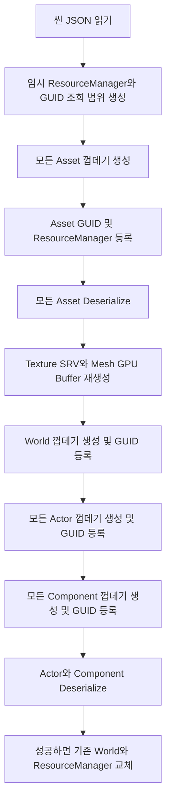

# 씬 직렬화 구조와 `UObject` 파생 클래스 구현 가이드

## 현재 로드 순서

질문에서 정리한 개념이 맞다. 정확한 실행 순서는 다음과 같다.



핵심은 **포인터를 복원하기 전에 참조 대상의 껍데기와 GUID가 모두 등록되어 있어야 한다**는 점이다. 예를 들어 첫 번째 액터의 컴포넌트가 두 번째 액터의 컴포넌트를 가리켜도, 모든 컴포넌트를 먼저 등록하기 때문에 `ResolveReference<T>()`가 대상을 찾을 수 있다.

에셋도 같은 원리를 사용한다. 먼저 `UTexture`, `UMaterial`, `UStaticMesh` 껍데기를 전부 생성하여 GUID와 에셋 이름을 등록한다. 이후 `UMaterial::BaseTexture`, `UStaticMesh::StaticMaterials` 같은 에셋 간 참조를 역직렬화한다. 마지막으로 저장 대상이 아닌 GPU 리소스를 다시 만든다.

로드는 임시 월드와 임시 리소스 매니저에서 진행된다. 모든 단계가 성공한 경우에만 현재 월드와 에셋을 교체한다. 중복 GUID, 존재하지 않는 참조, 잘못된 클래스, 텍스처 파일 누락, 잘못된 메시 인덱스 등이 발견되면 임시 객체를 제거하고 기존 씬을 유지한다.

## 저장되는 객체 그래프

씬 파일의 최상위 구조는 다음과 같다.

```json
{
  "Version": 1,
  "Assets": [],
  "World": {}
}
```

- `Assets`: `FResourceManager`가 소유한 텍스처, 머티리얼, 스태틱 메시
- `World`: 월드가 소유한 액터와 각 액터가 소유한 컴포넌트
- `ClassName`: `FObjectFactory`가 실제 클래스를 선택할 때 사용하는 이름
- `Properties.GUID`: 객체의 영속 식별자
- `AssetName`: 리소스 매니저에서 에셋을 찾을 때 사용하는 등록 이름

`InternalIndex`, GPU 포인터, 렌더 캐시, 계산된 바운드, 삭제 대기열 같은 실행 중 상태는 저장하지 않는다. 로드 후 원본 데이터에서 다시 만들거나 초기화한다.

## 앞으로 `UObject` 파생 클래스가 해야 할 일

새 클래스가 씬에 들어갈 수 있다면 아래 항목을 확인한다.

### 1. 리플렉션 선언

헤더에 직접 부모 클래스를 정확히 지정한다.

```cpp
class UHealthComponent : public UActorComponent
{
    REFLECT_CLASS(UHealthComponent, UActorComponent)

public:
    UHealthComponent() = default;
    void Initialize();

    void SerializeClass(json::JSON& OutJson) const override;
    void DeserializeClass(const json::JSON& InJson) override;

private:
    float MaxHealth = 100.0f;
    float CurrentHealth = 100.0f;
};
```

`REFLECT_CLASS`는 클래스 이름, 부모 `FClassInfo`, 기본 생성 함수를 만든다. 따라서 팩토리로 로드할 클래스에는 기본 생성이 가능해야 한다. 매크로가 마지막에 `private:`를 추가하므로 멤버의 접근 지정자를 명시적으로 배치하는 편이 안전하다.

### 2. 자신의 영속 데이터 직렬화

새 영속 데이터 멤버가 있으면 두 함수를 구현한다. 항상 부모 함수를 먼저 호출한다.

```cpp
void UHealthComponent::SerializeClass(json::JSON& OutJson) const
{
    UActorComponent::SerializeClass(OutJson);

    auto& Properties = OutJson["Properties"];
    Properties["MaxHealth"] = MaxHealth;
    Properties["CurrentHealth"] = CurrentHealth;
}

void UHealthComponent::DeserializeClass(const json::JSON& InJson)
{
    UActorComponent::DeserializeClass(InJson);

    const auto& Properties = InJson.at("Properties");
    MaxHealth = NumberFromJson(Properties.at("MaxHealth"));
    CurrentHealth = NumberFromJson(Properties.at("CurrentHealth"));
}
```

부모 호출을 빼면 `UObject`가 저장하는 `ClassName`과 `GUID`, 중간 부모가 저장하는 Transform 등의 데이터가 누락되거나 복원되지 않는다.

새 영속 멤버가 전혀 없는 클래스는 반드시 두 함수를 재정의할 필요는 없다. 부모 구현만 상속받아도 된다. 반대로 런타임에서 유지되어야 하는 값은 빠짐없이 저장하거나, 역직렬화 후 다른 저장 데이터로 다시 계산해야 한다.

숫자를 읽을 때는 정수형 JSON 토큰과 실수형 JSON 토큰을 모두 처리하는 `NumberFromJson()`을 사용한다. 배열 길이, 값의 범위, 필수 키와 JSON 타입도 검사하고 잘못된 데이터에는 예외를 발생시킨다. 이 예외가 씬 교체를 취소한다.

### 3. `UObject*` 계열 포인터는 GUID로 저장

직접 포인터 값이나 메모리 주소를 저장하면 안 된다. `ObjectReference()`와 `ResolveReference<T>()`를 사용한다.

```cpp
void UTargetComponent::SerializeClass(json::JSON& OutJson) const
{
    UActorComponent::SerializeClass(OutJson);
    OutJson["Properties"]["TargetActorGUID"] = ObjectReference(TargetActor);
}

void UTargetComponent::DeserializeClass(const json::JSON& InJson)
{
    UActorComponent::DeserializeClass(InJson);
    TargetActor = ResolveReference<AActor>(
        InJson.at("Properties").at("TargetActorGUID"));
}
```

`ObjectReference(nullptr)`은 JSON `null`을 저장하고 `ResolveReference<T>()`는 이를 `nullptr`로 복원한다. 대상이 없거나 `T`와 호환되지 않으면 로드를 실패시킨다.

단일 참조 키는 `TargetActorGUID`, `StaticMeshGUID`처럼 `GUID`로 끝내야 한다. 현재 저장 전 검증기가 이 이름 규칙으로 단일 GUID 참조를 찾는다. 포인터 배열을 새로 만들면 각 원소에 `ObjectReference()`를 사용하고, 해당 배열 키를 `ValidateSceneReferences()`의 배열 참조 목록에도 추가해야 한다. 현재 등록된 배열 키는 `Materials`와 `OverrideMaterials`이다.

GUID로 가리키는 객체는 반드시 같은 씬 파일의 객체 그래프에 들어 있어야 한다. 즉 다음 중 하나여야 한다.

- `FResourceManager`에 등록되어 `Assets`에 저장되는 에셋
- `UWorld`의 `Actors`에 포함된 액터
- 액터의 `Components`에 포함된 컴포넌트

씬 밖의 파일, 설정, 네트워크 리소스처럼 `UObject`가 아닌 외부 데이터는 GUID 대신 안정적인 경로나 별도 키를 저장한다.

### 4. 소유 객체와 참조 객체를 구분

포인터가 있다고 해서 모두 GUID 참조 하나로 끝나는 것은 아니다.

- **소유 객체**: 소유자가 객체 내용까지 중첩 저장하고, preload 단계에서 껍데기를 생성한다. 현재 `UWorld -> Actors`, `AActor -> Components`가 이에 해당한다.
- **참조 객체**: 다른 곳에서 소유하고 이미 preload되는 객체를 GUID로만 저장한다. `RootComponent`, `StaticMesh`, `BaseTexture`, 머티리얼 포인터가 이에 해당한다.

새 클래스가 다른 `UObject`들을 직접 소유한다면 단순한 `SerializeClass()` 추가만으로는 부족하다. 그 소유 배열을 순회하여 껍데기를 먼저 생성하는 preload 단계와 소멸자에서의 삭제 책임도 함께 구현해야 한다. 일반 참조라면 GUID 방식만 추가하면 된다.

### 5. `Initialize()`와 `DeserializeClass()`의 차이

일반 런타임 생성은 `ConstructObject<T>()`를 사용하며 다음 순서로 동작한다.

```text
기본 생성자 -> 런타임 클래스 설정 -> Initialize(...)
```

씬 로드는 `ConstructUnInitializedObject()`를 사용한다.

```text
기본 생성자 -> 런타임 클래스 설정 -> GUID 등록 -> DeserializeClass(...)
```

따라서 로드 시 `Initialize()`는 자동 호출되지 않는다. `Initialize()`가 입력값을 새 객체에 지정하거나 새 GUID를 전제로 하는 함수라면 이 동작이 맞다. 반면 로드 후 반드시 필요한 캐시나 파생 상태가 있다면 `DeserializeClass()` 마지막에 다시 계산해야 한다. 예를 들어 `UStaticMeshComponent`는 메시 참조를 복원한 뒤 `UpdateBounds()`를 호출한다. 텍스처 SRV와 메시 버퍼는 모든 에셋 역직렬화 후 `FResourceManager`가 재생성한다.

생성자에서는 포인터를 `nullptr`, 숫자와 플래그를 안전한 기본값으로 만들어야 한다. 역직렬화 도중 예외가 발생해도 소멸자가 부분 생성 상태를 안전하게 정리할 수 있어야 한다.

### 6. 소유권과 소멸 처리

현재 소유권 규칙은 다음과 같다.

| 소유자 | 소유 대상 | 삭제 책임 |
| --- | --- | --- |
| `FSceneManager` | 현재 `UWorld` | `FSceneManager` |
| `UWorld` | `Actors` | `UWorld` |
| `AActor` | `Components` | `AActor` |
| `FResourceManager` | 등록된 에셋 | `FResourceManager::ClearAll()` |
| 에셋 또는 컴포넌트의 GUID 포인터 | 참조 대상 | 삭제하지 않음 |

새 포인터 멤버를 추가할 때 이 포인터가 소유인지 참조인지 먼저 결정해야 한다. 참조 포인터를 소멸자에서 삭제하면 이중 해제가 발생한다.

## `FObjectFactory`의 역할

`FObjectFactory`는 JSON의 `ClassName`을 실제 C++ 타입으로 바꾸는 런타임 생성기다.

예를 들어 JSON에 다음 값이 있으면:

```json
{
  "ClassName": "UHealthComponent",
  "Properties": {}
}
```

로드 과정은 다음과 같다.

1. `GetClassInfoByName("UHealthComponent")`로 `FClassInfo`를 찾는다.
2. `FClassInfo::Constructor`로 `new UHealthComponent()`를 실행한다.
3. 생성된 객체의 `mClassInfo`를 `UHealthComponent::GetClass()`로 설정한다.
4. preload 단계에서 저장된 GUID를 등록한다.
5. 모든 껍데기가 준비된 뒤 가상 함수 `DeserializeClass()`를 호출한다.

### 팩토리 함수별 용도

| 함수 | `Initialize()` | `DeserializeClass()` | 용도 |
| --- | ---: | ---: | --- |
| `ConstructObject<T>(...)` | 호출 | 호출하지 않음 | 에디터나 게임 실행 중 새 객체 생성 |
| `ConstructUnInitializedObject<T>()` | 호출하지 않음 | 호출하지 않음 | 타입이 컴파일 타임에 정해진 preload |
| `ConstructUnInitializedObject(FClassInfo*)` | 호출하지 않음 | 호출하지 않음 | JSON의 `ClassName`으로 preload |
| `LoadObject<T>(Json)` | 호출하지 않음 | 즉시 호출 | 참조 선등록이 필요 없는 단순 독립 객체 |
| `LoadObject(FClassInfo*, Json)` | 호출하지 않음 | 즉시 호출 | 런타임 타입의 단순 독립 객체 |
| `PreloadObject<T>(Json)` | 호출하지 않음 | `UObject` 부분만 먼저 처리 | 씬 객체 그래프 로드 |

씬처럼 객체 간 포인터가 있는 그래프에서는 `LoadObject()`로 객체를 하나씩 즉시 완성하면 아직 생성되지 않은 대상을 찾지 못할 수 있다. 따라서 씬 로더에서는 `PreloadObject()`와 단계별 역직렬화를 사용한다. `LoadObject()`는 다른 객체에 대한 선행 참조가 없는 독립 데이터에만 사용하는 편이 안전하다.

### 새 클래스를 팩토리에 등록

씬 파일의 `ClassName`으로 생성될 수 있는 구체 클래스는 `FObjectFactory::mClassInfoMap`에 등록해야 한다.

```cpp
#include "HealthComponent.h"

TMap<FString, std::function<const FClassInfo*()>> FObjectFactory::mClassInfoMap = {
    // 기존 클래스...
    {"UHealthComponent", &UHealthComponent::GetClass},
};
```

또는 초기화 코드에서 동적으로 등록할 수 있다.

```cpp
const bool bRegistered = FObjectFactory::RegisterClassInfo(
    "UHealthComponent",
    UHealthComponent::GetClass());
```

현재 엔진은 정적 맵에 직접 추가하는 방식을 기본으로 사용하고, 테스트나 외부 확장 타입은 `RegisterClassInfo()`를 사용할 수 있다. 이름은 `REFLECT_CLASS`가 생성하는 클래스 이름 및 JSON의 `ClassName`과 정확히 같아야 한다. 중복 이름 등록은 `false`를 반환한다.

추상 클래스는 생성 대상이 아니므로 JSON에 직접 나타나지 않게 해야 한다. 현재 `REFLECT_CLASS`는 항상 `new className()` 생성자를 만들기 때문에 실제로 추상 클래스를 지원하려면 생성 함수가 없는 별도 리플렉션 매크로 또는 `FClassInfo` 구성이 필요하다.

## 에셋 클래스를 추가할 때

현재 `FResourceManager::DeserializeAssets()`는 아래 세 종류만 지원한다.

- `UTexture`
- `UMaterial`
- `UStaticMesh`

예를 들어 `USkeletalMesh`를 추가한다면 다음 작업이 모두 필요하다.

1. 클래스에 `REFLECT_CLASS`, `SerializeClass()`, `DeserializeClass()`를 구현한다.
2. `FObjectFactory`에 `USkeletalMesh`를 등록한다.
3. `FResourceManager`에 등록 맵과 `Register`/`Get` 함수를 추가한다.
4. `SerializeAssets()`가 새 맵을 저장하도록 추가한다.
5. `DeserializeAssets()`가 새 타입을 식별하여 임시 리소스 매니저에 등록하도록 추가한다.
6. CPU 원본 데이터나 소스 경로를 이용해 GPU 리소스를 재생성한다.
7. `ClearAll()`과 `SwapAssets()`에 새 맵을 추가한다.
8. 다른 에셋을 참조한다면 저장 전 등록 여부 검사와 GUID 복원 코드를 추가한다.

현재 메시의 정점과 인덱스는 씬 파일에 직접 저장하며, 텍스처는 `SourcePath`만 저장하고 원본 파일에서 다시 읽는다. 새 에셋마다 **씬에 원본 데이터를 포함할지, 외부 파일 경로를 저장할지** 정책을 정해야 한다.

## 새 클래스 체크리스트

- [ ] 직접 부모를 지정한 `REFLECT_CLASS`가 있는가?
- [ ] 기본 생성 후 모든 멤버가 안전한 상태인가?
- [ ] `Initialize()` 없이 로드되어도 `DeserializeClass()`가 완전한 상태를 만드는가?
- [ ] 영속 멤버를 저장하고 타입·범위 검사를 하며 읽는가?
- [ ] 부모의 `SerializeClass()`와 `DeserializeClass()`를 먼저 호출하는가?
- [ ] `UObject*` 참조를 GUID로 저장하고 올바른 타입으로 복원하는가?
- [ ] 참조 대상이 같은 씬 객체 그래프에 포함되는가?
- [ ] 소유 포인터라면 preload와 삭제 책임을 구현했는가?
- [ ] 저장하지 않는 캐시와 GPU 상태를 로드 후 다시 만드는가?
- [ ] JSON에서 생성되는 구체 클래스를 `FObjectFactory`에 등록했는가?
- [ ] 새 에셋 타입이라면 `FResourceManager`의 저장·로드·정리·교체 경로를 모두 확장했는가?
- [ ] 새 GUID 배열 키를 저장 전 참조 검증에 추가했는가?
- [ ] 정상 왕복, null 참조, 공유 참조, 앞/뒤 방향 참조, 잘못된 GUID를 테스트했는가?

## 앞으로 결정하면 좋은 구조 개선

현재 기능을 사용하는 데 당장 추가 결정이 필요한 것은 없다. 다만 클래스와 에셋 종류가 늘어나면 아래 부분은 정책을 정하는 편이 좋다.

1. **팩토리 자동 등록**: 지금처럼 중앙 맵에 수동 등록할지, 각 클래스가 정적 초기화로 스스로 등록할지 결정한다.
2. **PostLoad 단계**: GPU 생성과 캐시 계산을 개별 `DeserializeClass()` 또는 리소스 매니저에서 처리할지, 공통 `PostLoad()` 가상 함수로 분리할지 결정한다.
3. **씬 외부 참조**: 다른 씬이나 프로젝트 공용 에셋을 GUID로 찾을지, 에셋 경로와 별도 에셋 레지스트리를 사용할지 결정한다.
4. **에셋 저장 위치**: 큰 메시 데이터를 씬 JSON에 포함할지, 별도 에셋 파일로 분리하고 씬에는 GUID와 경로만 저장할지 결정한다.
5. **파일 버전 변환**: 클래스 필드가 바뀔 때 이전 `Version` 파일을 새 구조로 변환하는 migration 함수를 둘지 결정한다.

규모가 커질 것을 고려하면 우선순위는 `PostLoad()` 도입, 팩토리 자동 등록, 씬과 에셋 파일 분리 순서가 적절하다.
